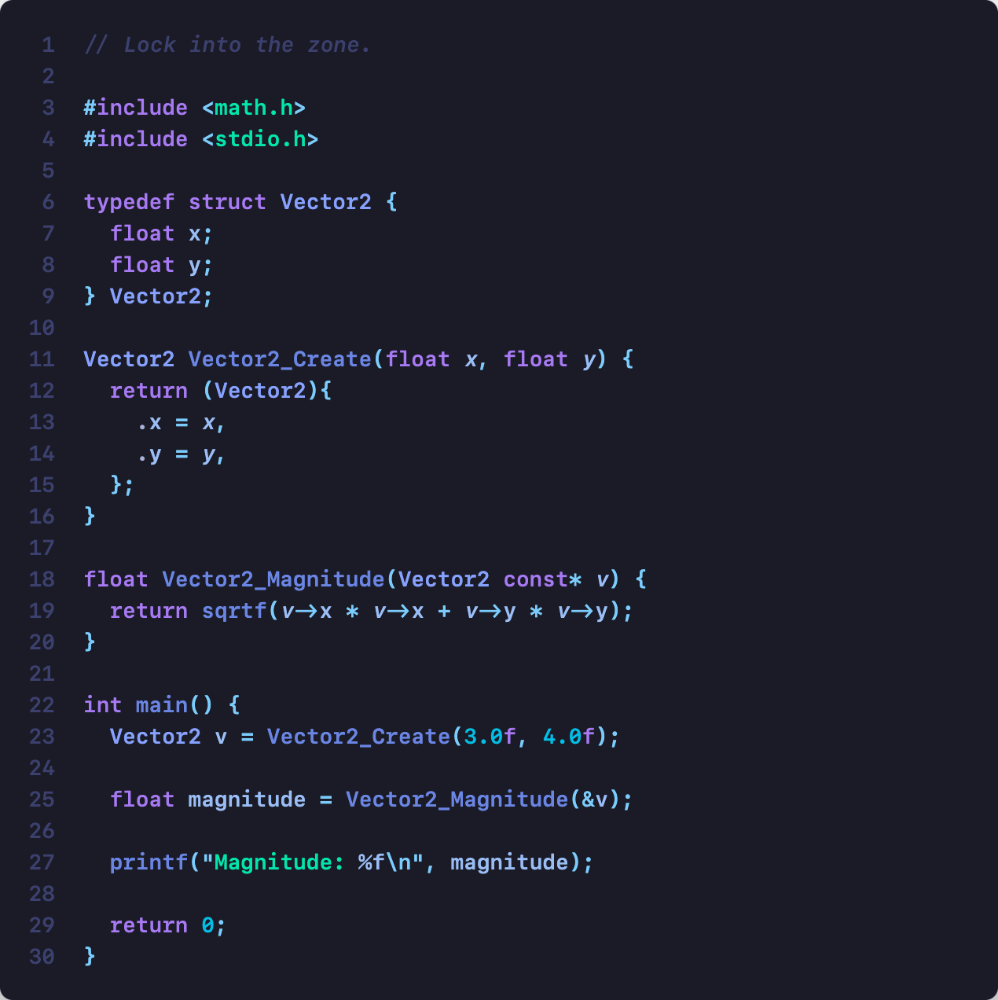
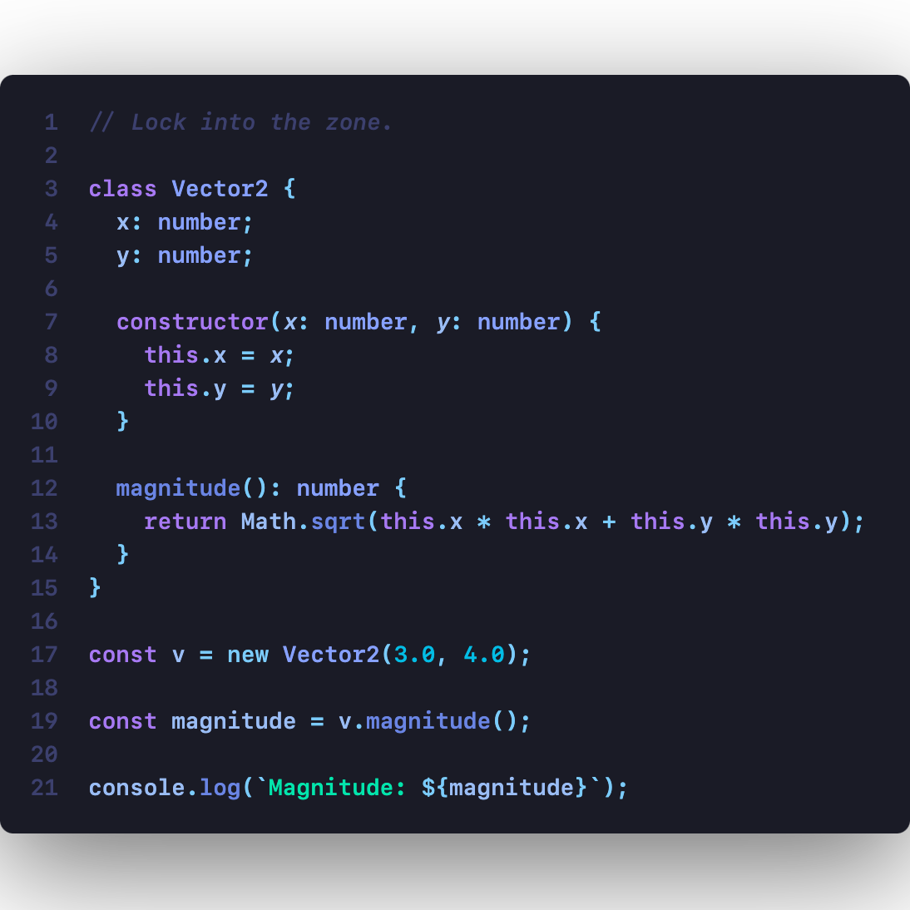
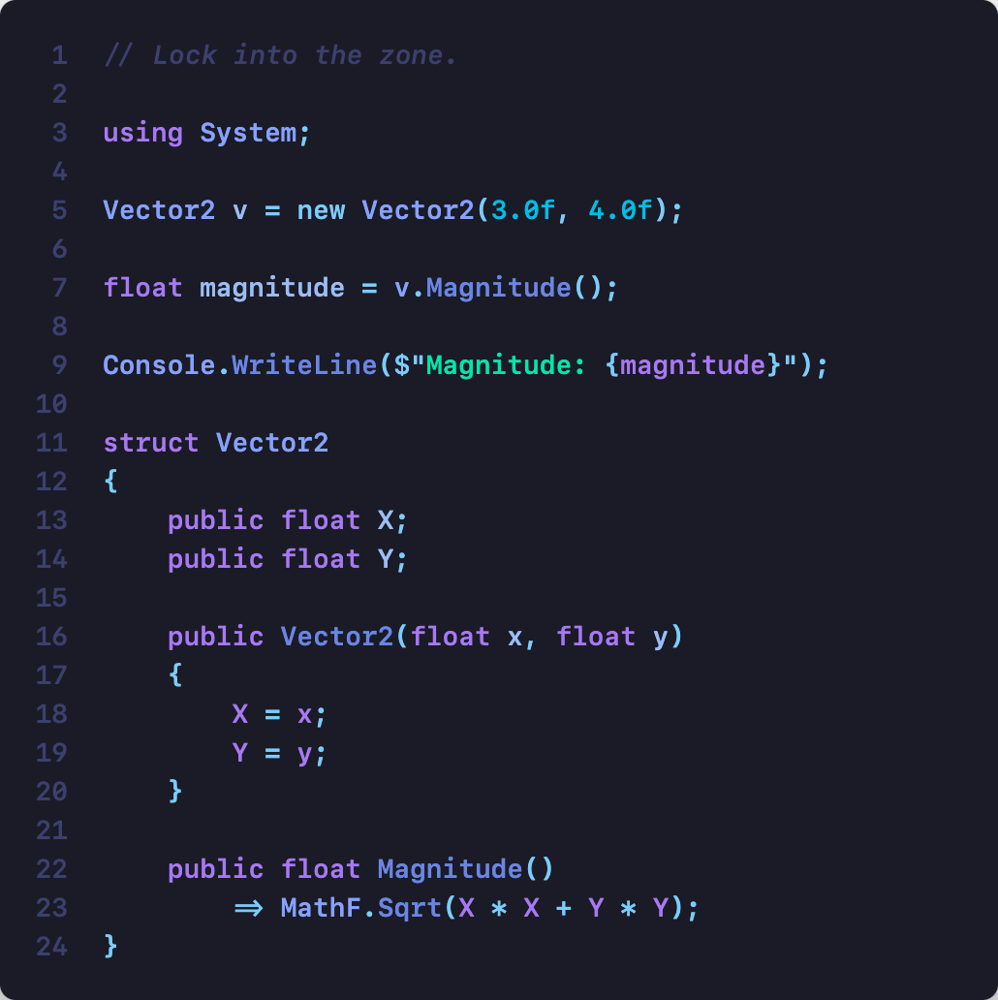
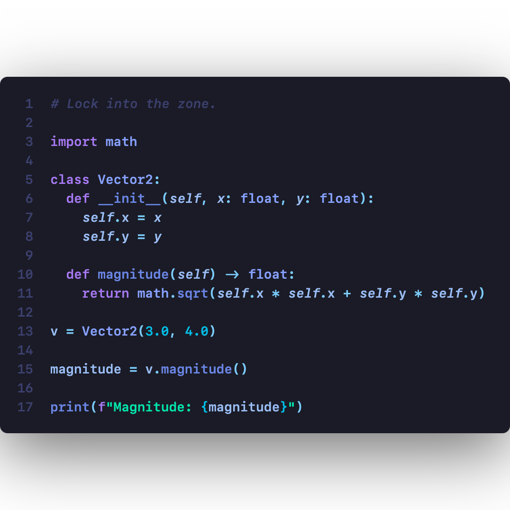
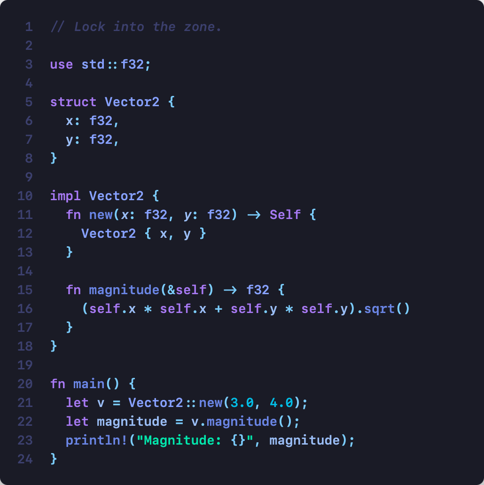
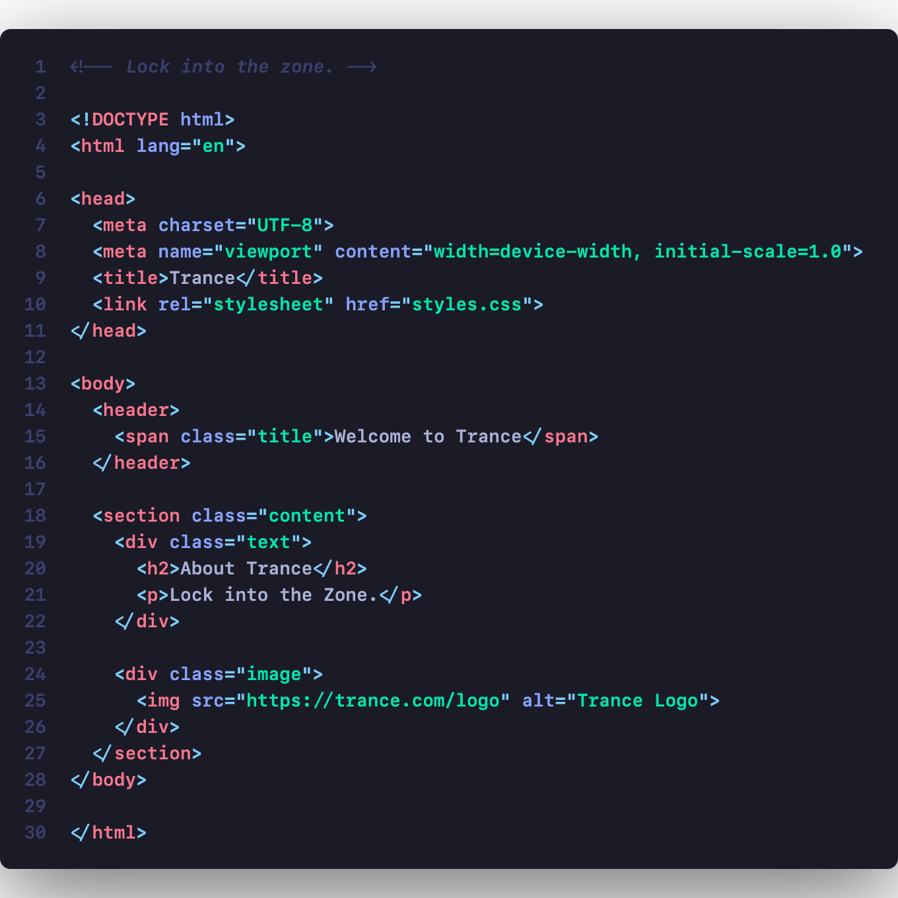
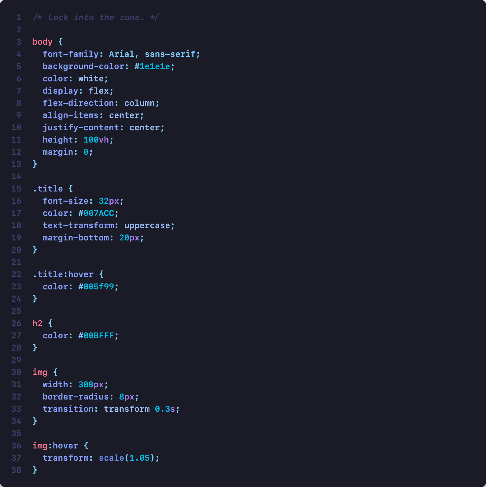

   A cool, blue, dark theme to help you stay locked in the zone.

 

## Color Palette

### Dark Theme

**Base Colors**
| Name | Hex | HSL |
|------|-----|-----|
| Background | `#14161F` | hsl(230 20 10) |
| Background Alt | `#292C3D` | hsl(230 20 20) |
| Foreground | `#F0F1F5` | hsl(230 20 95) |
| Foreground Muted | `#A3A8C2` | hsl(230 20 70) |

**Syntax Highlighting**
| Element | Hex | HSL |
|---------|-----|-----|
| Types | `#8095FF` | hsl(230 100 75) |
| Functions | `#667FFF` | hsl(230 100 70) |
| Variables | `#B3BFFF` | hsl(230 100 85) |
| Keywords | `#9966FF` | hsl(260 100 70) |
| Operators | `#66CCFF` | hsl(200 100 70) |
| Constants | `#00AAFF` | hsl(200 100 50) |
| Strings | `#00FFAA` | hsl(160 100 50) |

**Status Colors**
| Status | Hex | HSL |
|--------|-----|-----|
| Error | `#FF3355` | hsl(350 100 60) |
| Warning | `#FFBB33` | hsl(40 100 60) |
| Success | `#33FF99` | hsl(150 100 60) |
| Info | `#3399FF` | hsl(210 100 60) |

### Light Theme

**Base Colors**
| Name | Hex | HSL |
|------|-----|-----|
| Background | `#F8F9FC` | hsl(230 30 98) |
| Background Alt | `#E8EAEF` | hsl(230 20 85) |
| Foreground | `#202330` | hsl(230 20 15) |
| Foreground Muted | `#6B7280` | hsl(230 15 50) |

**Syntax Highlighting**
| Element | Hex | HSL |
|---------|-----|-----|
| Types | `#0055FF` | hsl(230 100 50) |
| Functions | `#4466FF` | hsl(230 80 60) |
| Variables | `#6B7FCC` | hsl(230 60 60) |
| Keywords | `#6B4ECC` | hsl(270 50 60) |
| Operators | `#0099BB` | hsl(190 100 50) |
| Constants | `#0055AA` | hsl(210 100 43) |
| Strings | `#008855` | hsl(150 50 37) |

**Status Colors**
| Status | Hex | HSL |
|--------|-----|-----|
| Error | `#D40C5C` | hsl(345 98 42) |
| Warning | `#C68000` | hsl(35 100 40) |
| Success | `#008855` | hsl(150 50 37) |
| Info | `#0077DD` | hsl(210 100 50) |
